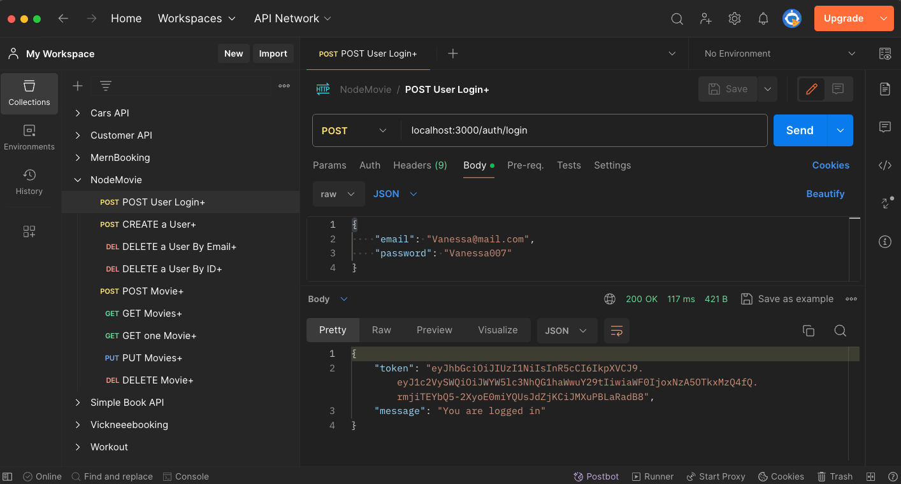
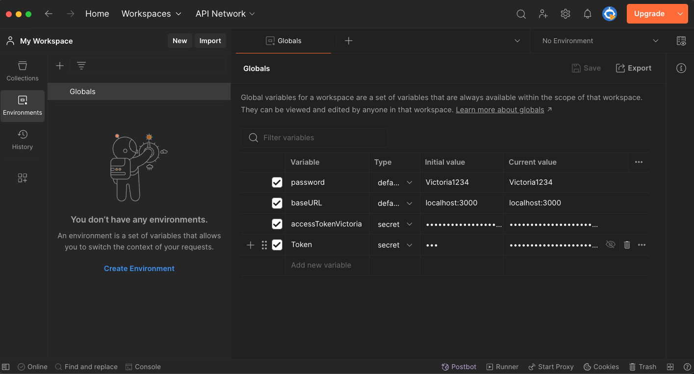
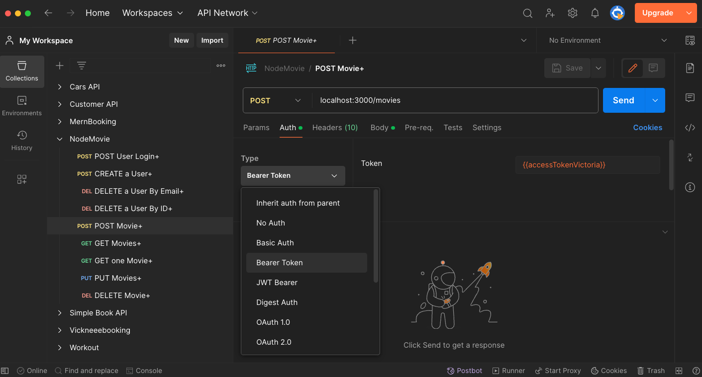
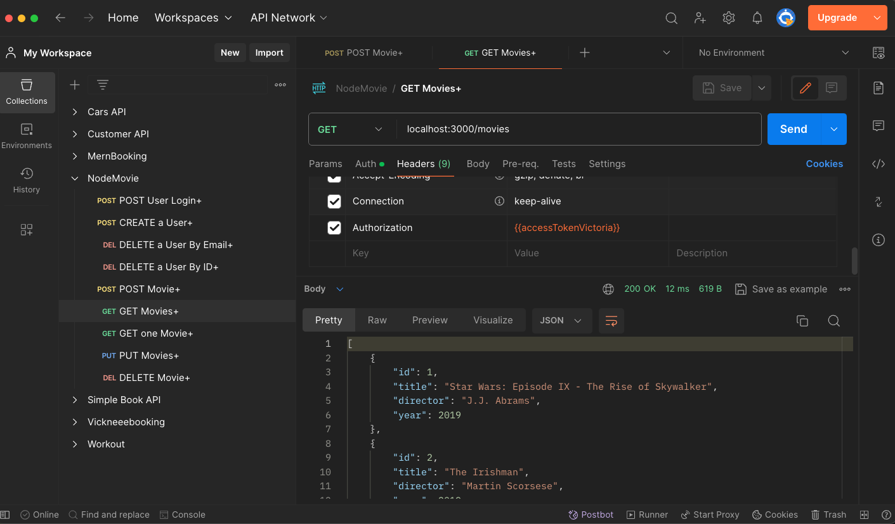

# Postman Authorization Setup

1. First, you need to obtain the token. If you're using the application described in the context, you can do this by sending a POST request to the `/users/auth/login` endpoint with the `email` and `password` in the request body. The response will contain the token.

2. Once you have the token, go to the "Environment" section in Postman (located in the top left corner).

3. Click on the "Globals" button to create a new variable.

4. In the "Globals", add a new variable named `Token` (or any name you prefer). You can add to the Initial value  `---`.

5. To the Current value, add your token. Save. This will create a global variable that you can use in your requests. You can also create more variables if you want to use different tokens for different environments (e.g., development, testing, production)

6. In the request that requires authentication, go to the "Authorization" tab and select "Bearer Token" from the TYPE dropdown. In the "Token" field, enter `{{Token}}`. This will insert the value of the `Token` variable from the current environment.

7. Now, when you send this request, it will include the Bearer token in the Authorization header, authorizing the request.

---

1. Get Token from Login

2. Make Global Variable

3. Use Global Variable

4. Header with Authorization Bearer Token

---
