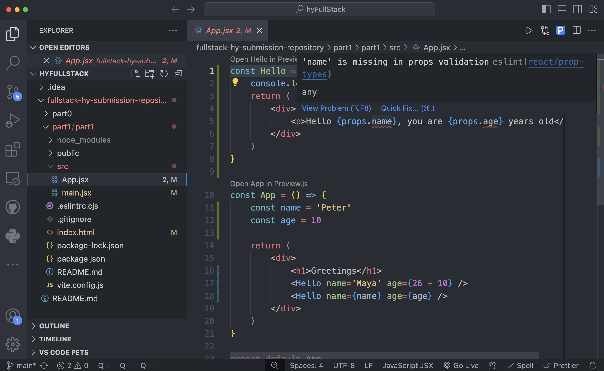
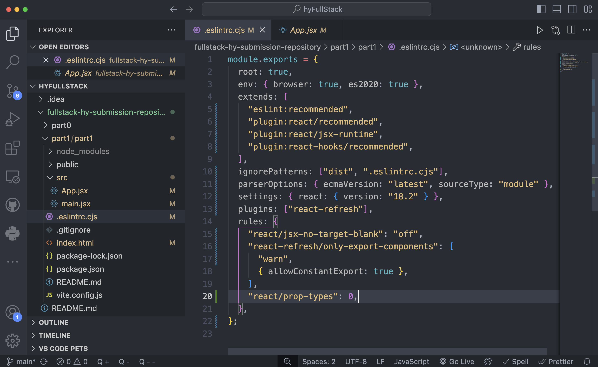

# Visual Studio Code ESLint Error Messages

Possible error messages you may encounter when using ESLint in any IDE.



It's not an actual error, but a warning caused by the ESLint tool. You can silence the warning react/prop-types by adding to the file .eslintrc .cjs the next line: ('react/prop-types': 0)

```javascript
module.exports = {
   root: true,
   env: { browser: true, es2020: true },
   extends: [
     'eslint:recommended',
     'plugin:react/recommended',
     'plugin:react/jsx-runtime',
     'plugin:react-hooks/recommended',
   ],
   ignorePatterns: ['dist', '.eslintrc.cjs'],
   parserOptions: { ecmaVersion: 'latest', sourceType: 'module' },
   settings: { react: { version: '18.2' } },
   plugins: ['react-refresh'],
   rules: {
     'react-refresh/only-export-components': [
       'warn',
       { allowConstantExport: true },
     ],
     'react/prop-types': 0
   },
};
```


